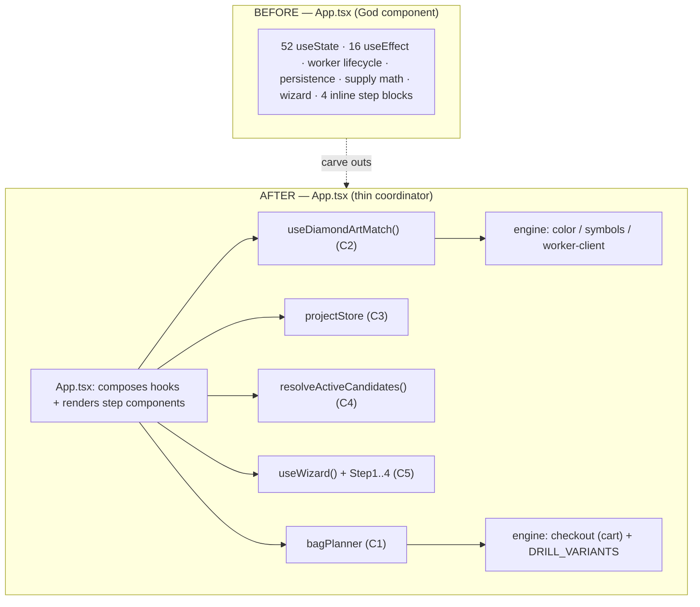

# Detailed Design — GemPixel Architecture Deepening

**Status:** Approved for planning. **Repo:** `gempixel` (`master`). **Date:** 2026-07-10.

This is a **standalone** design document. A cold-start agent should be able to plan or execute from
this file plus [`../research/current-state.md`](../research/current-state.md) (exact as-is anchors)
and [`../idea-honing.md`](../idea-honing.md) (binding decisions). No other reading required.

---

## 1. Overview

GemPixel is a client-side (Preact + Vite + TS + Tailwind v4) diamond-art planner: image → grid of
DMC colors via CIEDE2000 (in a Web Worker) → supply counts → printable/exportable canvas + vendor
checkout. As it nears v1, all logic friction is concentrated in one shallow God component
(`src/App.tsx`, 3321 lines, 52 `useState`). This effort carves **five deep modules** out of it and
fixes one latent correctness bug, with **no user-facing behavior change** except that fix.

Guiding lens: **depth** (a lot of behaviour behind a small interface), **locality** (change/bugs/
knowledge concentrated in one place), **leverage** (what callers gain), and the **deletion test**
(delete the module — does complexity vanish, or reappear across callers?).

## 2. Detailed Requirements (consolidated)

**Functional**
- R1. A single Supply Bag Optimizer owns all drill-supply packing + cost. The legend cost estimate
  and the Shopify cart are derived from the **same per-color packing** primitive (dye-lot rule +
  `DRILL_VARIANTS` availability). Estimate == cart for the same inputs. *(bug fix)*
- R2. The image→grid pipeline (worker match → substitution → symbol allocation → legend split) is a
  single `useDiamondArtMatch` hook exposing a small signal surface; `App` no longer orchestrates the
  worker directly.
- R3. All project + recent-image `localStorage` persistence lives in a `projectStore` module with a
  small CRUD interface; quota eviction is internal and unit-tested.
- R4. Palette selection is a named pure resolver `resolveActiveCandidates(kit, exclusions)`,
  memoized at the call site (removes per-render allocation).
- R5. The 4-step wizard is a `useWizard` hook (step/validity/transitions) plus four pure step view
  components `Step1Ingest`…`Step4Export`.

**Non-functional**
- N1. No user-facing behavior change except R1's reconciliation.
- N2. Strict TDD (failing test at each new seam first). All 99 existing tests stay green after every
  increment; every new module gets unit tests. (idea-honing Q4)
- N3. Five sequential atomic commits, each verified green (`tsc` + `vitest` + `build`) before the
  next. (idea-honing Q2, Cardinal Rule 4)
- N4. Respect the client-only, no-server, Web-Worker constraints; no new heavy deps (developer
  profile: browser-native / lightweight first).
- N5. Preserve engine-layer depth; do not touch the `palette.ts` / `variants.ts` catalogs.

## 3. Architecture Overview



New files (all under `src/`):
- `src/engine/bagPlanner.ts` — C1 (deep supply module; `checkout.ts` cart compiler consumes it).
- `src/features/match/useDiamondArtMatch.ts` — C2 hook. *(create `src/features/` if absent)*
- `src/engine/projectStore.ts` — C3 persistence module.
- `src/engine/candidates.ts` — C4 `resolveActiveCandidates`.
- `src/features/wizard/useWizard.ts` + `src/features/wizard/steps/Step{1..4}*.tsx` — C5.

> **Note on structure:** the repo currently has no `src/features/` dir (only `src/engine/` +
> `src/App.tsx`). Hooks/components go under `src/features/<slice>/`; pure logic goes under
> `src/engine/`. Confirm this split during Candidate 2 (first hook) and keep it consistent.

## 4. Components and Interfaces

### Candidate 1 — `src/engine/bagPlanner.ts` (deep supply module)

The seam that both the estimate and the cart pack through. **Per-color packing is the primitive.**

```ts
export type Shape = 'square' | 'round';

// Result of packing ONE color's required count into concrete bags.
export interface ColorPack {
  bySize: Record<number, number>;   // e.g. { 200: 2, 500: 0, 1000: 1 } — only sizes that exist for this color
  totalDrills: number;              // sum(size * qty)
  packets: number;                  // sum of quantities
}

// Pack a single color, respecting the dye-lot rule (<=800 -> 200-bags only)
// AND the bag sizes actually available for this DMC code+shape in DRILL_VARIANTS.
export function packColor(dmcCode: string, shape: Shape, requiredCount: number): ColorPack;

// +10% safety margin, rounded up to the smallest available bag size for the color.
// NOTE: per-color rounding needs the color's available sizes, so this MUST take dmcCode+shape
// (a bare requiredCount cannot know the smallest available size). Either give it the color args
// below, or do the rounding inside planColorSupply and keep withSafetyMargin a pure +10% count bump.
export function withSafetyMargin(dmcCode: string, shape: Shape, requiredCount: number): number;

// Price a ColorPack using the per-size price table (priceDb from App state).
export function priceColorPack(pack: ColorPack, priceDb: Record<number, number>): number;

// Convenience for the legend row: pack (exact + safety) and price both.
export interface ColorSupplyRow {
  exact: ColorPack; safety: ColorPack; costExact: number; costSafety: number; bagsText: string;
}
export function planColorSupply(
  dmcCode: string, shape: Shape, count: number, priceDb: Record<number, number>
): ColorSupplyRow;
```

- `checkout.ts::compileShopifyCartLink` is refactored to build its per-color tokens by calling
  `packColor(...)` instead of its inline packing loop (`checkout.ts:80-104`), so cart and estimate
  share one algorithm. The existing dye-lot `optimizeBags(count)` in `checkout.ts` either becomes a
  thin wrapper over `packColor` (aggregate, no variant availability) or is removed if unused after
  refactor — verify consumers first.
- App's `sortedMatches` legend loop (`App.tsx:1130-1180`) is **two branches gated by the
  `#optimize-bags-checkbox` (`optimizeBagsCost`) state**, not one. Only the *checked* branch
  (`~:1137-1165`) uses the cost-minimizer `optimizeBags(count, priceDb)` → this branch moves to
  `planColorSupply(...)`. The *unchecked* branch (`~:1166-1180`) uses
  `calculateSafetyPurchase(count, drillBagSize)` — a manual, user-chosen **uniform** bag size
  independent of `DRILL_VARIANTS`, which `bagPlanner`'s per-color API cannot reproduce. Per N1
  (no user-facing change except R1) that manual branch stays as-is, so **`calculateSafetyPurchase`
  stays local to `App.tsx`** (do NOT move it). App's cost-minimizer `optimizeBags` (`App.tsx:169`)
  is **removed**; only `getDefaultPacketCost` moves into `bagPlanner.ts` (as `defaultPacketCost`).
  `print.test.tsx` needs only **partial** repointing: its `optimizeBags` block moves; its
  `calculateSafetyPurchase` (safety-margin) block stays untouched.
- **Depth:** callers say "plan supplies for this color" and get bags + cost that always match the
  cart. **Deletion test:** removing it re-duplicates packing across estimate + cart (its raison
  d'être).

### Candidate 2 — `src/features/match/useDiamondArtMatch.ts`

```ts
export interface MatchInputs {
  image: HTMLImageElement | null;
  cols: number; rows: number;
  activeCandidates: DmcColor[];         // from Candidate 4
  enableSubstitution: boolean; substitutionThreshold: number;
}
export interface MatchState {
  matchResult: { matches: string[]; counts: Record<string, number> } | null;
  symbolMap: ColorSymbolMap;
  loading: boolean; progress: number;   // 0-100
}
export function useDiamondArtMatch(inputs: MatchInputs): MatchState;
```

- Owns: `MatcherClient` construction/teardown (`new URL('../../engine/matcher.worker.ts', import.meta.url)`),
  `abort`, cache-hash reuse, `rawMatchResult`, `loading`/`progress`, and the derived `matchResult`
  (via `color.substituteLowCountColors`) + `symbolMap` (via `symbols.generateSymbolAllocation`).
  Note: `generateSymbolAllocation(codes, dmcCodes)` takes two `string[]` args — pass
  `activeCandidates.map(c => c.dmc)`, **not** `DmcColor[]`. `ColorSymbolMap` is exported from
  `symbols.ts`, not `types.ts`. `App.test.tsx` already mocks `MatcherClient` directly (mirror it).
- App consumes `{ matchResult, symbolMap, loading, progress }` and keeps only the viewer-feed effect
  (which depends on `matchResult`). Legend split (`leftLegendColors/rightLegendColors`) can stay in
  App or move into the hook — keep in App (it depends only on `activeCandidates`, not the match).
- **Depth:** worker lifecycle + derivation behind four read-only signals. **Deletion test:** the
  pipeline reappears wherever a match is needed.

### Candidate 3 — `src/engine/projectStore.ts`

```ts
export interface ProjectSummary { /* moved verbatim from App.tsx:12 */ }
export interface ProjectData    { /* moved verbatim from App.tsx:20 */ }

export const projectStore = {
  list(): ProjectSummary[];
  load(id: string): ProjectData | null;
  save(summary: ProjectSummary, data: ProjectData): void;   // handles quota eviction internally
  remove(id: string): void;
  recents: {
    list(): RecentImage[];
    push(item: RecentImage): void;                           // pops oldest on quota exceed
  };
};
export function generateUUID(): string;
export function generateThumbnail(canvas: HTMLCanvasElement): string;
```

- All `localStorage` keys, serialization, and quota-eviction logic move here (from `App.tsx:42-114`
  + the ~`:601` recents effect). App calls `projectStore.save(...)` / `.load(...)` etc.
- **Also repoint the 4 raw-`localStorage` bypass sites** that don't go through the exported functions
  today: `projectsRegistry` init read (`~:245-252`), `recentImages` init read (`~:288-293`), the
  post-save registry reload in `handleSaveProject` (`~:542-543`), and the delete-handler registry
  filter (`~:1333-1335`). Missing these leaves storage logic duplicated in `App.tsx`.
- `RecentImage` **does not exist as a named type today** (only an inline/anonymous shape) — author it
  in this module, don't "move" it. `save`'s quota eviction is **new** (`saveProjectToStorage` has none
  today), and eviction direction differs: the **registry** appends newest (oldest = index 0) while
  **recents** prepend newest (oldest = last element) — a naive `.pop()` on the registry deletes the
  *newest* project. Tests need `// @vitest-environment jsdom` (default vitest env is node → no
  `localStorage`).
- **Depth:** storage shape + quota rules in one place. **Deletion test:** complexity reappears at
  every save/load site.

### Candidate 4 — `src/engine/candidates.ts`

```ts
export function resolveActiveCandidates(
  kit: 'all' | '100' | '200',
  excluded: Set<string>
): DmcColor[];   // pure: DMC_PALETTE filtered by kit, minus excluded
```

- App replaces **only** the inline `activeCandidates` (`:563-567`) with
  `const activeCandidates = useMemo(() => resolveActiveCandidates(selectedBaseKit, excludedColors), [selectedBaseKit, excludedColors])`.
  **`baseCandidates` is NOT dead — keep it.** Beyond feeding `activeCandidates` it is independently
  consumed by `toggleColorExclusion`'s "keep one active" guard (`~:917`), `handleDeselectAll`
  (`~:932-933`), and two kit-browser render blocks (`~:1824`, `~:2763`); deleting it breaks the build.
- The exclusion/identity field on `DmcColor` is **`dmc`** (a string), not `code`; kit membership is
  `kits: ("100"|"200")[]`. Resolver: `DMC_PALETTE` filtered by `kits`, minus any `dmc` in `excluded`.
- **Depth:** small but names a load-bearing concept and removes a per-render allocation.

### Candidate 5 — `src/features/wizard/`

```ts
// useWizard.ts
export interface WizardApi {
  step: number;                         // 1..4
  canEnter(step: number): boolean;      // validity (single source; replaces duplicated checks)
  next(): void; back(): void; goTo(step: number): void;
  reset(): void;
}
export function useWizard(deps: { hasImage: boolean; hasMatch: boolean; isTestEnv: boolean }): WizardApi;
```

- Step view components are **pure receivers** (props in, JSX out; no `useState` mirroring engine
  state): `Step1Ingest`, `Step2Palette`, `Step3Canvas`, `Step4Export` — each is the corresponding
  inline block extracted (`App.tsx:1370 / 1693 / 1908 / 2238`) with its needed values/handlers passed
  as props. App renders `{wizard.step === 1 && <Step1Ingest .../>}` etc. and the nav footer reads
  `wizard.canEnter(n)`. **The block contents differ from what the component names imply — verified
  against the live code:**
  - `Step1Ingest` (`:1370`–`:1691`): ingest + fit mode + preset sizes + sizing units + width/height
    + drill style (~322 lines; sizeable props surface).
  - `Step2Palette` (`:1693`–`:1906`): kit `<select>` + drill-type `<select>` + substitution controls
    + the DMC Supply List legend table. Its exclusion checklist iterates **`baseCandidates`**, not
    `activeCandidates` (else already-excluded colors vanish and exclusion is irreversible).
  - `Step3Canvas` (`:1908`, name is misleading): the **"Cost & Order" form** — vendor select, canvas
    price/shipping, `#optimize-bags-checkbox`, per-bag pricing, cost breakdown, order/print/download
    actions, sizing advice, affiliate settings. It does **NOT** contain the pixel-canvas viewport HUD
    (`~:2522-2708`, gated by `image &&`) or the interactive color legend `<aside>` (`~:2710-2916`) —
    both are persistent chrome rendered outside any `wizardStep` gate; do not move them.
  - `Step4Export` (`:2238`, name is misleading): **Summary stats + "Save to My Images" form + reset**
    — not export/print/cart. Export/print buttons live in the Step 3 block; "BUY SUPPLIES →" lives in
    the persistent legend `<aside>` (`~:2989`), gated only by `matchResult`.
- **Nav validity is duplicated across 4 sites**, not "dots vs buttons": a mobile/sidebar footer
  (`~:2382-2435`) and a desktop top progress bar (`~:2438-2484`), each with its own dots + Next.
  There is also a **5th `wizardStep` reference** outside the four blocks: the print-only checklist
  guard at `~:3299` (`{wizardStep === 3 && matchResult && ...}`) — must be updated when App's
  `wizardStep` state is removed, or the build breaks.
- `useWizard`'s deps `hasImage`/`hasMatch` **do not exist as App state** — derive them inline
  (`!!(image || activeProjectId)`, `!!matchResult`).
- **Depth:** transition/validity rules in one hook; steps become nameable units. **Deletion test:**
  validity duplication returns (footer dots vs buttons).

## 5. Data Models

- `ColorPack`, `ColorSupplyRow` (C1) — see interfaces above. `priceDb: Record<number, number>` maps
  bag size → unit price (already App state).
- `ProjectSummary` / `ProjectData` (C3) — moved verbatim; no shape change (preserves saved-project
  compatibility in `localStorage`).
- `MatchState` (C2), `WizardApi` (C5) — hook return shapes.
- No changes to `DmcColor`, `ColorSymbolMap`, `DRILL_VARIANTS`, `DMC_PALETTE`.

## 6. Error Handling

- **C1:** `packColor` on an unknown DMC code or a color with no available sizes returns an empty
  `ColorPack` (`bySize:{}, totalDrills:0, packets:0`) — mirrors `compileShopifyCartLink`'s current
  `unmappedItems` fallback; the caller still lists the color, just with no purchasable bags. Never
  throw in the render path (Cardinal Rule spirit: no crashes in hot UI).
- **C2:** worker `error` messages are already logged by `MatcherClient`; the hook surfaces
  `loading=false` and leaves `matchResult` unchanged on error (no partial state). Abort on new
  inputs before dispatching (existing behavior).
- **C3:** `load` returns `null` on missing/corrupt JSON (existing `try/catch` behavior preserved);
  `save`/`recents.push` catch `QuotaExceededError` and evict oldest (existing behavior, now
  centralized + tested).
- **C4:** pure; no error modes.
- **C5:** `goTo`/`canEnter` guard invalid transitions (can't enter step 3/4 without a match) — the
  single source of truth replacing scattered `isStepValid` checks.

## 7. Testing Strategy

Strict TDD, RED→GREEN per behavior (tracer-bullet — never all-tests-first). New unit tests at each
new seam; all 99 existing tests stay green each increment.

- **C1 `bagPlanner.test.ts` (new):** dye-lot boundary (≤800 → 200-only), per-color variant
  availability (a color missing 1000 must not be packed into 1000), safety margin, pricing. **Key
  regression test:** for a fixture set of colors, assert the summed `planColorSupply` bag counts
  equal what `compileShopifyCartLink` builds (estimate == cart). Update `checkout.test.ts` if the
  dye-lot `optimizeBags` signature changes; repoint `print.test.tsx` imports (or replace its
  cost-minimizer assertions).
- **C2 `useDiamondArtMatch.test.ts` (new):** mock `MatcherClient` (as `App.test.tsx` already mocks
  `CanvasViewer`); assert progress→result flow, substitution toggle changes `matchResult`, symbolMap
  regenerates, teardown calls `terminate`. `App.test.tsx`/`integration.test.tsx` stay green.
- **C3 `projectStore.test.ts` (new):** save→list→load round-trip; delete; recents FIFO; quota
  eviction via a stubbed `localStorage` that throws `QuotaExceededError`.
- **C4 `candidates.test.ts` (new):** kit filters ('all'/'100'/'200'), exclusion removal, empty
  exclusion set identity.
- **C5 `useWizard.test.ts` (new):** transitions, `canEnter` gating (no match → can't reach 3/4),
  `isTestEnv` bypass. Step components covered by existing integration tests staying green + a `npm run
  dev` visual pass.

## 8. Appendices

### A. Technology choices
- No new dependencies. Hooks use Preact's `preact/hooks` (already in use). Persistence stays on
  native `localStorage`. Packing math is plain TS. (developer profile: lightweight/browser-native.)

### B. Alternative approaches considered
- **C1 — cost-minimizer as source of truth:** rejected (idea-honing Q1) — it drops the dye-lot color
  consistency rule that the cart enforces; the cart is what the user actually buys.
- **C1 — keep both, just label them:** rejected — leaves two algorithms that can still be edited
  apart; the whole point is one packing primitive.
- **C5 — hook-only (leave JSX inline):** rejected (idea-honing Q3) — user chose full extraction for
  the readability win; risk mitigated by integration tests + visual pass.
- **Big-bang single PR:** rejected (idea-honing Q2) — 5 atomic increments give clean rollback.

### C. Risks
- Highest risk is **C5** (JSX surgery on a near-v1 UI) and **C1** (behavior *does* change for the
  cost estimate — this is intended, but screenshots/regression tests must confirm the new numbers are
  the *correct* cart-matching ones, not a regression). Sequence C1 first (bug fix, small surface) and
  C5 last (largest surface, most cosmetic).
- Line numbers drift as increments land; every increment re-greps anchors before editing.
