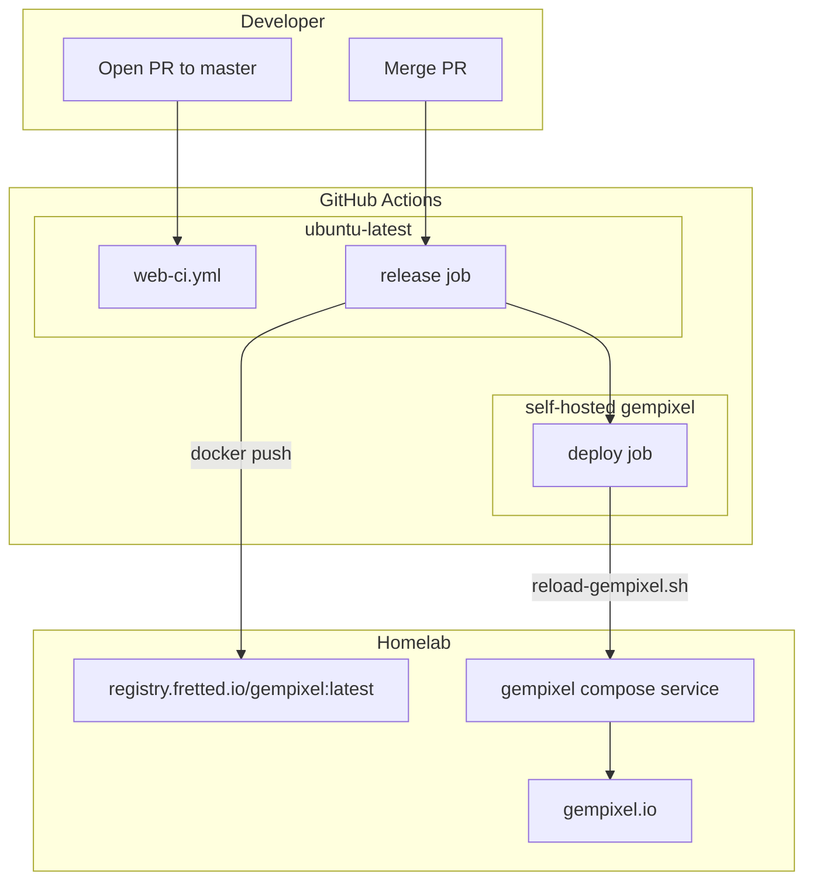

# Detailed design: gempixel.io CI/CD and Docker

Standalone design for automated deployment of the **Vite static build** to **https://gempixel.io** via **Docker**, **`registry.fretted.io`**, and a **self-hosted GitHub Actions runner** on the homelab. Mirrors the fretted.io pipeline.

Default branch: **`master`**. Release tags use plain semver without a `v` prefix.

---

## Overview

GemPixel is a client-side Preact + Vite app with no server component. This design adds:

1. **Pull-request CI** — `npm test` + `npm run build` on every PR to `master`.
2. **Release & deploy pipeline** — on every merged PR to `master`: semver tag, Docker push to `registry.fretted.io/gempixel:latest`, GitHub Release, homelab reload via self-hosted runner.

---

## Detailed requirements

| ID | Requirement |
|----|-------------|
| CI-1 | PR workflow: `npm ci` → `npm test` → `npm run build` → verify script |
| CI-2 | Release workflow on push to `master` only via merged PR |
| BUILD-1 | Multi-stage Docker: Node 22 builds `dist/`, nginx:alpine serves it |
| BUILD-2 | Push `registry.fretted.io/gempixel:latest` only |
| BUILD-3 | Open registry — no docker login in v1 |
| DEPLOY-1 | Self-hosted runner label `gempixel` runs `~/infra/reload-gempixel.sh` |
| REL-1 | Semver tags; patch default; `release:minor` / `release:major` PR labels |

---

## Architecture overview

---

## Components

### Workflows

- **`web-ci.yml`** — PR gate, no Docker.
- **`release.yml`** — version computation, test, Docker build/push, GitHub Release, deploy job.

### Docker

- **`docker/Dockerfile`** — builder runs `npm ci && npm run build`; runtime is nginx with SPA config.
- **`docker/nginx.conf`** — no-cache `index.html`, immutable `/assets/`.

### Scripts

- **`verify-web-export.sh`** — validates `dist/index.html` references an on-disk JS bundle.
- **`publish-web.sh`** — local manual publish path.

---

## Error handling

- Missing PR on merge commit → release job fails (no orphan deploys).
- Conflicting `release:minor` + `release:major` labels → fail.
- Duplicate semver tag → fail.
- Build verify script fails if bundle reference is broken.
---

## Testing strategy

- CI runs full Vitest suite (178 tests) on every PR and release.
- `verify-web-export.sh` runs after every build in CI and inside Dockerfile.
---

## Appendices

### Server-side infra (out of repo)

Must exist on homelab before first deploy:

1. `~/infra/gempixel/docker-compose.yml`
2. `~/infra/reload-gempixel.sh`
3. `~/infra/runner` — `gempixel-runner` compose service
4. Reverse proxy / TLS for gempixel.io

### Deferred

- Registry authentication
- Per-version image tags
- Path-filtered deploys
