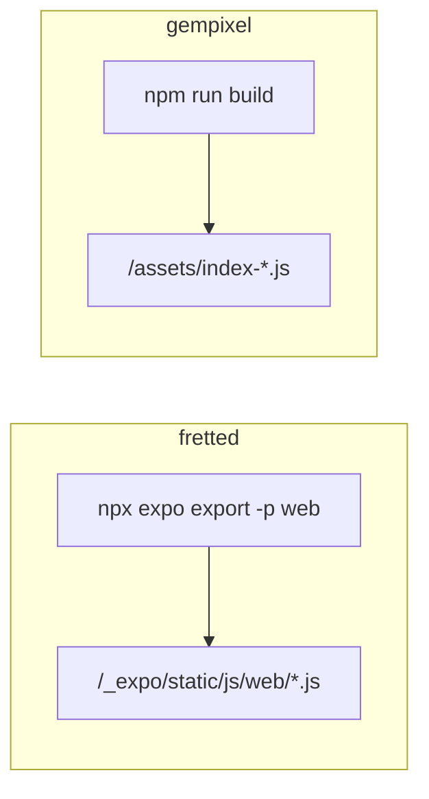

# Research: fretted deploy mirror

## Source repo

`../fretted` — Black-Maple-Code/fretted, Expo web static export deployed to fretted.io.

## Key artifacts mirrored

| fretted | gempixel adaptation |
|---------|---------------------|
| `.github/workflows/web-ci.yml` | Same structure; `master` branch; `npm run build` instead of `expo export` |
| `.github/workflows/release.yml` | `registry.fretted.io/gempixel:latest`, `reload-gempixel.sh`, runner label `gempixel` |
| `docker/Dockerfile` | Node 22 builder + nginx:alpine; Vite `npm run build` |
| `docker/nginx.conf` | SPA + immutable `/assets/` (no `/_expo/` paths) |
| `scripts/verify-web-export.sh` | Checks `/assets/index-*.js` in `dist/index.html` |
| `scripts/publish-web.sh` | Manual image build/push |
| `.dockerignore` | Excludes tests, node_modules, planning docs |

## Differences from fretted

- **Branch:** fretted `main` → gempixel `master`
- **Runner:** `fretted` label → `gempixel` label (new compose service)
- **Reload script:** `reload-fretted.sh` → `reload-gempixel.sh` (homelab infra, not in repo)

## Test suite status

178 tests across 20 files — all pass with `npm test` (Vitest + jsdom).

## References

- [fretted docs/deploy.md](../../../../docs/deploy.md) (relative from planning dir: use repo `docs/deploy.md` in fretted)
- [fretted .agents/planning/2026-06-22-fretted-web-deploy/](../../../../fretted path — see fretted repo)
