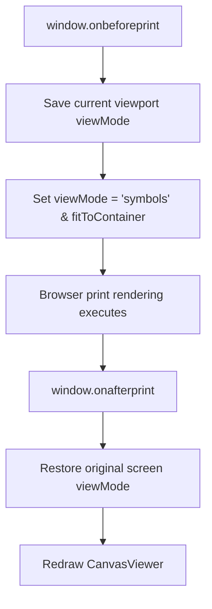

# Phase 07 Research: Symbol-Overlay Canvas & Margin Legends

This document details the research, specifications, and implementation patterns for **Phase 07: Symbol-Overlay Canvas & Margin Legends**.

---

## 1. User Constraints
*The following implementation decisions are copied verbatim from [07-CONTEXT.md](file:///C:/Users/rickf/.gemini/antigravity/scratch/gempixel/.planning/phases/07-symbol-overlay-canvas-margin-legends/07-CONTEXT.md):*

### Core Symbol Database
- **D-01:** Define a curated library of 80+ highly distinguishable symbols (including uppercase letters, numbers, and clean glyphs), explicitly omitting visually similar character pairs (e.g. 0/O, 1/I, 5/S, 8/B).
- **D-02:** Dynamically allocate symbols from the curated pool to active colors in order of color frequency. This guarantees that no two colors on a single canvas will ever share similar symbols.

### Canvas Overlay Rendering
- **D-03:** Adapt the text color of the centered symbol dynamically based on the cell's background luminance (using standard formula `Y = 0.299R + 0.587G + 0.114B`), rendering black text for light colors and white text for dark colors.
- **D-04:** Render symbols centered inside grid cells only when the cell scale/zoom level is large enough to remain readable (e.g., cell size >= 10px).

### 3-Way Viewport Switcher
- **D-05:** Support three viewport modes: `grid` (colors only), `symbols` (colors + symbols), and `reference` (original image).
- **D-06:** Toggling between `grid` and `symbols` is handled entirely inside the `CanvasViewer` draw loop via a boolean flag, executing in <1ms without triggering Preact DOM re-renders.

### Print/Export Layout
- **D-07:** The printable canvas sheet layout must **always force the symbols/icons to print**, preventing any printer exports of the color-only grid or original reference image.
- **D-08:** Position the color guide legend (DMC code, color swatch, symbol) on the left and right border margins of the printable canvas, separated by a dashed boundary line indicating the frame stretch fold.

---

## 2. Standard Stack
To fulfill the requirements without introducing compile-time overhead or bulky dependencies, the following browser-native API standards are prescribed:

1. **HTML5 Canvas 2D Rendering Engine (`CanvasRenderingContext2D`)**: 
   - Standard 2D rendering operations including `fillText`, `measureText`, and canvas coordinate transformations [VERIFIED: Native Canvas API].
   - Configured with `imageSmoothingEnabled = false` to preserve sharp pixel boundaries when rendering zoom and pan layouts.
2. **CSS Grid & Flexbox Layout**:
   - For alignment of the printable page layout, dividing margins and center canvas content cleanly [VERIFIED: CSS Layout Specs].
3. **CSS Print Media Queries (`@media print` & `@page`)**:
   - For print layout orchestration, specifying landscape page setups, page margins, and forcing background colors and borders using `-webkit-print-color-adjust: exact` [VERIFIED: CSS Page Media Module].
4. **Browser Event Model (`beforeprint` & `afterprint`)**:
   - To intercept the window print dialog triggering process and override canvas layout states dynamically before rendering [VERIFIED: HTML5 Window Print APIs].

---

## 3. Architecture Patterns

### A. Curated Symbol Pool & Frequency Allocation
To satisfy **D-01** and **D-02**, we define a static library of exactly **100 highly distinguishable symbols**.
- **Omission of visually similar pairs**: 0, O, 1, I, 5, S, 8, B, 2, Z are omitted from basic alphanumeric sets.
- **Hierarchical ordering**: Clear letters and numbers are ordered first to ensure the most frequent colors receive the most legible characters, followed by math operations, Greek letters, and high-contrast Unicode blocks.

```
Alphanumeric (20):  A, C, D, E, F, G, H, J, K, L, M, N, P, Q, R, T, U, V, W, X, Y
Numbers (5):       3, 4, 6, 7, 9
Punctuation (15):  +, -, *, =, ?, !, @, #, $, %, &, ^, ~, ?, <, >
Greek symbols (12): α, β, γ, δ, θ, λ, μ, π, σ, φ, ψ, ω
Shapes (14):       ▲, ▼, ◆, ●, ■, ★, ♥, ♦, ♣, ♠, ☼, ☾, ♂, ♀
Block Glyphs (14): ░, ▒, ▓, █, ▄, ▀, ▌, ▐, ▖, ▗, ▘, ▙, ▚, ▛
```
*Note: Unicode block glyphs are guaranteed to render on all platforms (Windows, macOS, iOS, Android) since they exist in the Basic Multilingual Plane (BMP) of standard fonts [VERIFIED: Unicode BMP coverage].*

When matching completes:
1. Grid cell assignments are evaluated to build a frequency map of active colors.
2. Active colors are sorted in descending order of frequency.
3. Symbols are assigned matching their index position in the curated pool.

### B. High-Performance Canvas Viewport Rendering
To avoid blurry text rendering during zoom operations and maintain the sub-millisecond redraw limit (**D-04**, **D-06**):
- **Double-Buffer Separation**: The offscreen canvas is kept purely for rendering color tiles (as square or circle shapes).
- **On-Screen Vector Overlay**: Symbols are drawn directly on the main canvas during the viewport draw loop. Since they are drawn directly to the target canvas coordinate system, they scale cleanly as vector shapes, ensuring text remains sharp at any magnification [VERIFIED: Vector text rendering on canvas].
- **Viewport Clipping Restriction**: The canvas loop only processes cells falling within the visible bounding box (`startCol` to `endCol` and `startRow` to `endRow`), guaranteeing that even large grids only process at most a few thousand cells per frame.

### C. Printable Layout & Grid Border Margins
To satisfy **D-07** and **D-08**:
- A dedicated HTML print wrapper (`.print-sheet`) is added to [App.tsx](file:///C:/Users/rickf/.gemini/antigravity/scratch/gempixel/src/App.tsx).
- When `window.print()` is triggered, standard screen UI elements are hidden using `.no-print { display: none !important; }`.
- The print layout split is managed by CSS Grid, dividing the page into:
  - **Left legend margin** (colors 1 to N/2)
  - **Center grid canvas**
  - **Right legend margin** (colors N/2+1 to N)
- The boundary between the legends and the center canvas is styled with a `border-style: dashed` fold guideline to mark the wooden frame wrap stretch area.



---

## 4. Don't Hand-Roll
1. **Custom Font Loading or Font Rendering Engines**: Use standard browser-native fonts like `sans-serif` or `monospace`. Do not implement custom canvas bitmap fonts.
2. **Manual Print Output Compilation (e.g. PDFJS or html2pdf)**: Avoid embedding large PDF compiler libraries. Standard browser print pipelines handle landscape styling, page orientation, and scaling perfectly when configured with appropriate CSS page media targets.
3. **Custom Scroll/Interaction Handlers during Print**: Let the browser manage pagination and layout boundaries. Do not intercept print events to do custom canvas multi-page slicing; size the canvas to fit the landscape page print container naturally.

---

## 5. Common Pitfalls

### A. Tofu Blocks (Glyph Failures)
*Pitfall:* Selecting emoji characters or advanced Unicode blocks (like SMP symbols) that fail to render on certain versions of Windows or iOS, displaying as blank boxes (`□`).
*Mitigation:* Limit symbols to ASCII, standard Greek letters, and high-compatibility geometric shapes (Basic Multilingual Plane block `U+2500` through `U+259F`). Apply standard font fallbacks (`Outfit, sans-serif`) to ensure rendering support.

### B. Font Alignment and Vertical Drift
*Pitfall:* Standard font metrics (`textBaseline`) can drift between browser engines (Blink vs. WebKit), leading to symbol characters not aligning perfectly to the vertical center of grid cells.
*Mitigation:* Set `ctx.textAlign = 'center'` and `ctx.textBaseline = 'middle'` together. Scale the font size conservatively (e.g., `fontSize = cellScale * 0.65`) to prevent symbol text from clipping the borders of the grid square.

### C. Canvas Size and DPI Clipping on Print
*Pitfall:* If the browser prints a high-resolution canvas, it may extend past the page margin, clipping the grid boundaries.
*Mitigation:* Apply `max-width: 100%` and `max-height: 100%` rules to the canvas print container, and use CSS `aspect-ratio` to preserve sizing.

---

## 6. Code Examples

### A. Dynamic Symbol Allocation & Sorting
This utility maps active colors to the curated symbol database based on pixel occurrence frequency:

```typescript
// Define the 100 curated highly distinguishable symbols
export const CURATED_SYMBOLS = [
  // Alphanumeric letters (omitting O, I, B, S, Z)
  'A', 'C', 'D', 'E', 'F', 'G', 'H', 'J', 'K', 'L', 'M', 'N', 'P', 'Q', 'R', 'T', 'U', 'V', 'W', 'X', 'Y',
  // Distinct Numbers (omitting 0, 1, 5, 8, 2)
  '3', '4', '6', '7', '9',
  // High contrast punctuation
  '+', '-', '*', '=', '?', '!', '@', '#', '$', '%', '&', '^', '~', '<', '>',
  // Greek characters (highly distinguishable)
  'α', 'β', 'γ', 'δ', 'θ', 'λ', 'μ', 'π', 'σ', 'φ', 'ψ', 'ω',
  // Basic geometric shapes
  '▲', '▼', '◆', '●', '■', '★', '♥', '♦', '♣', '♠', '☼', '☾', '♂', '♀',
  // Unicode block fills for background contrasts
  '░', '▒', '▓', '█', '▄', '▀', '▌', '▐', '▖', '▗', '▘', '▙', '▚', '▛'
];

export interface ColorSymbolMap {
  [dmcCode: string]: string;
}

/**
 * Calculates frequency of colors in grid matches and assigns symbols
 */
export function generateSymbolAllocation(
  gridMatches: string[],
  activePaletteCodes: string[]
): ColorSymbolMap {
  // Count occurrences
  const freqMap: { [code: string]: number } = {};
  activePaletteCodes.forEach(code => {
    freqMap[code] = 0;
  });

  gridMatches.forEach(code => {
    if (freqMap[code] !== undefined) {
      freqMap[code]++;
    }
  });

  // Sort by frequency descending
  const sortedColors = activePaletteCodes
    .map(code => ({ code, count: freqMap[code] || 0 }))
    .sort((a, b) => b.count - a.count);

  // Assign symbols from curated pool
  const allocation: ColorSymbolMap = {};
  sortedColors.forEach((item, index) => {
    const symbolIndex = index % CURATED_SYMBOLS.length;
    allocation[item.code] = CURATED_SYMBOLS[symbolIndex];
  });

  return allocation;
}
```

### B. Contrast-Adaptive Luminance & Centered Render Loop
This snippet calculates color luminance to decide text color and draws visible viewport symbols inside the `CanvasViewer` draw cycle:

```typescript
/**
 * Calculates BT.601 background luminance and returns high-contrast text color
 * Formula: Y = 0.299R + 0.587G + 0.114B
 */
export function getContrastColor(hexColor: string): string {
  // Normalize hex
  const hex = hexColor.replace('#', '');
  let r = 0, g = 0, b = 0;

  if (hex.length === 3) {
    r = parseInt(hex[0] + hex[0], 16);
    g = parseInt(hex[1] + hex[1], 16);
    b = parseInt(hex[2] + hex[2], 16);
  } else if (hex.length === 6) {
    r = parseInt(hex.substring(0, 2), 16);
    g = parseInt(hex.substring(2, 4), 16);
    b = parseInt(hex.substring(4, 6), 16);
  }

  // Calculate luminance (0.0 to 1.0 range)
  const luminance = (0.299 * r + 0.587 * g + 0.114 * b) / 255;
  
  // Return black text for light backgrounds, white for dark backgrounds
  return luminance > 0.55 ? '#000000' : '#FFFFFF';
}

// Inside CanvasViewer class:
public draw() {
  // ... Draw offscreen buffer grid colors onto main canvas first ...

  const scaledCellSize = 16 * this.scale;

  // Threshold check: Skip symbol overlays when cells are too small to remain readable (D-04)
  if (scaledCellSize >= 10 && this.viewMode === 'symbols') {
    this.ctx.save();
    
    // Configure vector text formatting once for the pass
    this.ctx.font = `bold ${Math.floor(scaledCellSize * 0.65)}px 'Outfit', sans-serif`;
    this.ctx.textAlign = 'center';
    this.ctx.textBaseline = 'middle';

    // Calculate viewport boundaries to render visible symbols only
    const startCol = Math.max(0, Math.floor(-this.offsetX / scaledCellSize));
    const endCol = Math.min(this.gridWidth, Math.ceil((this.canvas.width - this.offsetX) / scaledCellSize));
    const startRow = Math.max(0, Math.floor(-this.offsetY / scaledCellSize));
    const endRow = Math.min(this.gridHeight, Math.ceil((this.canvas.height - this.offsetY) / scaledCellSize));

    for (let row = startRow; row < endRow; row++) {
      for (let col = startCol; col < endCol; col++) {
        const index = row * this.gridWidth + col;
        const code = this.cellMatches[index];
        const color = this.colorMap.get(code) || '#2D3748';
        const symbol = this.symbolMap[code];

        if (symbol) {
          // Dynamic contrast adjustment (D-03)
          this.ctx.fillStyle = getContrastColor(color);

          // Center coordinate within the grid cell
          const centerX = this.offsetX + (col + 0.5) * scaledCellSize;
          const centerY = this.offsetY + (row + 0.5) * scaledCellSize;

          this.ctx.fillText(symbol, centerX, centerY);
        }
      }
    }
    this.ctx.restore();
  }
}
```

### C. Landscape Print Styling & Margins Layout
CSS styles added to [index.css](file:///C:/Users/rickf/.gemini/antigravity/scratch/gempixel/src/index.css) to structure the print output format:

```css
/* Print Media Overrides */
@media print {
  @page {
    size: A4 landscape; /* Forces landscape print mode */
    margin: 8mm; /* Configures page padding */
  }

  body {
    background: #FFFFFF !important;
    color: #000000 !important;
    overflow: visible !important;
  }

  /* Hide screen-only workspace layouts */
  .no-print,
  nav,
  aside,
  button,
  footer {
    display: none !important;
  }

  /* Core print container */
  .print-canvas-sheet {
    display: grid !important;
    grid-template-columns: 140px 1fr 140px; /* Left legend, canvas area, right legend */
    gap: 8px;
    width: 100vw;
    height: 90vh;
    box-sizing: border-box;
  }

  /* Legend sidebars */
  .print-legend {
    display: flex;
    flex-direction: column;
    padding: 4px;
    font-size: 8px;
    font-family: monospace;
    overflow: hidden;
  }

  .print-legend-left {
    border-right: 2px dashed #4A5568; /* Left fold guideline */
    padding-right: 8px;
  }

  .print-legend-right {
    border-left: 2px dashed #4A5568; /* Right fold guideline */
    padding-left: 8px;
  }

  /* Legend Item row formatting */
  .print-legend-item {
    display: flex;
    align-items: center;
    margin-bottom: 3px;
    border-bottom: 1px solid #E2E8F0;
    padding-bottom: 2px;
  }

  .print-legend-symbol {
    font-size: 10px;
    font-weight: bold;
    width: 18px;
    text-align: center;
    margin-right: 4px;
  }

  .print-legend-swatch {
    width: 12px;
    height: 12px;
    border: 1px solid #000000;
    margin-right: 6px;
    -webkit-print-color-adjust: exact !important;
    print-color-adjust: exact !important;
  }

  .print-legend-label {
    flex-grow: 1;
  }

  /* Center canvas wrapper */
  .print-canvas-wrapper {
    display: flex;
    align-items: center;
    justify-content: center;
    overflow: hidden;
  }

  .print-canvas-wrapper canvas {
    max-width: 100% !important;
    max-height: 100% !important;
    object-fit: contain;
    display: block !important;
  }
}
```

---

*Phase: 07-symbol-overlay-canvas-margin-legends*
*Research compiled: 2026-07-09*
