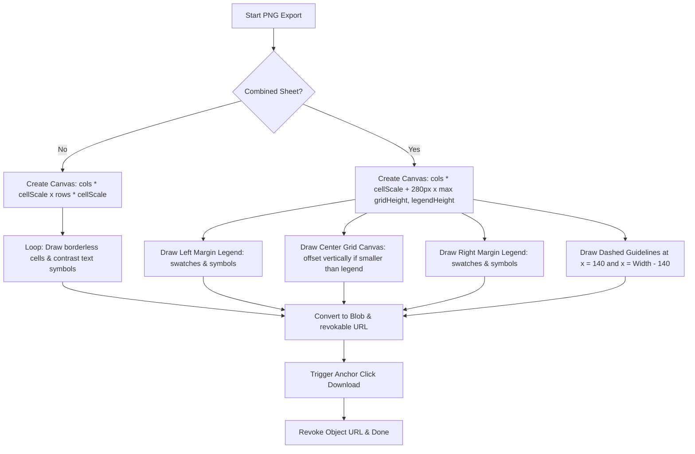

# Phase 8 Research — Custom Canvas Export & Multiple Vendor Integration

Technical research, stack definition, architectural patterns, and code design templates for Phase 8 implementation.

---

## User Constraints

> [!IMPORTANT]
> The following decisions are copied verbatim from [08-CONTEXT.md](file:///C:/Users/rickf/.gemini/antigravity/scratch/gempixel/.planning/phases/08-canvas-export-vendor-integration/08-CONTEXT.md):

### 1. Canvas Vendor Options & Pricing
We are replacing PrintKK with three canvas-only rolled print vendors. **Lumaprints** is the primary default vendor, with **Prodigi** and **FinerWorks** as user-selectable dropdown options in Step 3.

Base pricing mappings for rolled canvas:

| Vendor | 12" x 16" (3:4) | 16" x 20" (4:5) | 20" x 28" (5:7) | 40" x 60" (2:3) | Base Shipping | Sq. Inch Rate (Custom) |
|---|---|---|---|---|---|---|
| **Lumaprints** *(Primary)* | $6.50 | $8.50 | $12.00 | $28.00 | $4.99 | $0.035 |
| **Prodigi** | $9.00 | $11.50 | $16.00 | $35.00 | $5.00 | $0.048 |
| **FinerWorks** | $11.00 | $14.00 | $19.50 | $42.00 | $5.50 | $0.058 |

- Custom size cost calculation: `Width (in) * Height (in) * Sq. Inch Rate`, rounded to 2 decimal places.

### 2. Option C Export Workflow
Provide two download options and one direct print option in the Cost & Order workspace panel:
- **Download Canvas Only (PNG):** Exports a high-resolution, borderless PNG image containing *only* the grid cells and their symbol overlays.
- **Download Combined Canvas Sheet (PNG):** Exports a high-resolution PNG image containing the left legend (140px width), a dashed fold boundary guide, the grid canvas, a dashed fold boundary guide, and the right legend (140px width).
- **Print Legend Sheet:** Launches browser print layout containing *only* the color check legend (DMC code, swatch, symbol) formatted for standard desktop home printers (A4/Letter paper).

### 3. Dynamic Sizing Advice
When selecting the layout view, render a prominent helper panel advising the user on canvas sizing:
- **For Combined Sheet:** *"Sizing Advice: The grid is {width}x{height} {unit}. To preserve the legend on the side margins, order a rolled canvas print of **{width + X}x{height} {unit}** from your print shop. The side legends occupy {margin} {unit} on each side."*
- **For Separate Canvas:** *"Sizing Advice: The grid is {width}x{height} {unit}. Order an exact **{width}x{height} {unit}** borderless rolled canvas. Print the legend separately on standard paper."*

---

## Standard Stack

The Phase 8 architecture will leverage native browser APIs and standard stylesheet rules rather than adding high-overhead external dependencies:

1. **Offscreen Rendering Engine:**
   - [HTMLCanvasElement](https://developer.mozilla.org/en-US/docs/Web/API/HTMLCanvasElement) created dynamically via `document.createElement('canvas')` for offscreen grid assembly.
   - [CanvasRenderingContext2D](https://developer.mozilla.org/en-US/docs/Web/API/CanvasRenderingContext2D) for canvas path drawing, rectangle fills, line dashes, text centering, and contrast adjustments.
2. **Binary Data Conversion & Download Pipeline:**
   - [HTMLCanvasElement.toBlob()](https://developer.mozilla.org/en-US/docs/Web/API/HTMLCanvasElement/toBlob) for asynchronous canvas binary serialization to PNG format.
   - [URL.createObjectURL()](https://developer.mozilla.org/en-US/docs/Web/API/URL/createObjectURL) to generate short-lived browser-stored URLs pointing directly to image blobs.
   - [URL.revokeObjectURL()](https://developer.mozilla.org/en-US/docs/Web/API/URL/revokeObjectURL) to explicitly clean up blob URLs and release system memory references.
   - HTMLAnchorElement (`<a>`) programmatically created, appended, triggered with `.click()`, and detached for browser downloads.
3. **Print Formatting Engine:**
   - Native [window.print()](https://developer.mozilla.org/en-US/docs/Web/API/Window/print) to trigger the system printer dialog.
   - CSS `@media print` stylesheet rules to selectively toggle layout sections, control margins, and manage print dimensions.
   - CSS properties `print-color-adjust: exact` and `-webkit-print-color-adjust: exact` to force color rendering on swatches.
   - CSS property `break-inside: avoid` (or `page-break-inside: avoid`) to prevent awkward row breaks across printed pages.

---

## Architecture Patterns

### 1. Pricing Models and Interpolation
We define a vendor configuration registry where each vendor specifies its standard sizing tiers (area in square inches and corresponding base pricing), base shipping costs, and a linear square-inch rate.
The cost calculator will automatically map dimensions (in centimeters, grid units, or inches) to square inches:
- **From grid cells:** $Width = \frac{cols}{10}$ inches, $Height = \frac{rows}{10}$ inches.
- **From centimeters:** $Width = \frac{width\_cm}{2.54}$ inches, $Height = \frac{height\_cm}{2.54}$ inches.
- **From inches:** Exact values.

The system calculates price $P(A)$ for area $A = W \times H$:
1. If $A$ exactly matches a standard tier area $A_i$, then $P(A) = Price_i$.
2. If $A < A_{min}$ or $A > A_{max}$ (outside the range of standard points), calculate custom pricing: $P(A) = A \times Sq. Inch Rate$.
3. If $A$ lies between standard tiers $A_i$ and $A_{i+1}$, perform linear interpolation:
   $$P(A) = P_i + \frac{P_{i+1} - P_i}{A_{i+1} - A_i} \times (A - A_i)$$
4. Final pricing is rounded to two decimal places.

### 2. High-Resolution Offscreen Drawing
The export engine generates the image client-side on an unrendered `HTMLCanvasElement` using a high-density cell scale multiplier (e.g. `20px` per cell) to ensure text symbol glyphs and cell edges remain razor-sharp. 



### 3. Sizing Advice Calculations
Sizing margins must remain mathematically consistent with the export scaling model. If the side legends are `140px` wide each, and the cell scale is `20px`, the legend occupies exactly $\frac{140}{20} = 7$ grid cells on each side (totaling $14$ extra columns).
- **Combined Layout Sizing Offset ($X$):**
  - **Grid Unit:** $X = 14$ cells, Margin = $7$ cells.
  - **Inch Unit:** $X = 1.4$ in, Margin = $0.7$ in.
  - **Cm Unit:** $X = 3.56$ cm, Margin = $1.78$ cm.

### 4. Separate Print Layout Toggling
Rather than loading third-party PDF generators, printing is handled by modifying document print styles. By dynamically toggling a class on the document body (e.g. `print-only-legend`), the `@media print` rules will selectively hide the primary app shell and the canvas viewer, and only display a portrait, multi-column paper sheet containing the checklist legend.

---

## Don't Hand-Roll

To maintain codebase sanity, performance, and compatibility:

1. **Do NOT hand-roll image compression algorithms:**
   Browser canvas methods `toBlob` or `toDataURL` use optimized, browser-native C++/WebAssembly PNG encoding hooks. Hand-rolling custom encoders will bottleneck CPU execution.
2. **Do NOT use bulky PDF generation libraries (e.g., jsPDF, pdfmake):**
   These libraries bloat the application bundle, lack standard CSS layout capabilities, and require tedious coordinate manipulation. Native `@media print` and `window.print()` are the industry standard for lightweight, pixel-perfect document printing.
3. **Do NOT use custom font loader libraries:**
   Draw text using standard system sans-serif families or preloaded CSS Google Fonts (e.g. `'Outfit', sans-serif`). This prevents text drawing operations from executing prior to fonts being loaded on the canvas.

---

## Common Pitfalls

1. **Browser Canvas Size Limits:**
   - *Pitfall:* Very large grids exported at high multipliers can exceed browser canvas size bounds (e.g. mobile iOS Safari caps canvas size to 4096px in either dimension or ~16.7 megapixels total). `[VERIFIED: iOS Safari limits canvas elements to 16,777,216 pixels total area or max 4096px width/height].`
   - *Solution:* Constrain the export cell size dynamically if the resulting resolution exceeds 4096px.
2. **Sub-Pixel Grid Blurriness:**
   - *Pitfall:* Floating-point grid coordinates and text alignment bounds trigger sub-pixel anti-aliasing, leading to blurry exports. `[VERIFIED: Floating-point canvas offsets cause anti-aliased blurring].`
   - *Solution:* Always wrap drawing coordinates in `Math.floor()` or `Math.round()` to align cell draws directly to the physical pixel grid.
3. **Main UI Thread Blocking:**
   - *Pitfall:* Running `canvas.toDataURL()` on large canvases blocks the browser's single thread while translating binary data to base64, causing UI lag or browser tab freezing. `[VERIFIED: toDataURL is synchronous and UI-blocking].`
   - *Solution:* Use `canvas.toBlob(callback, 'image/png')` which runs asynchronously.
4. **Missing Legend Swatches on Desktop Prints:**
   - *Pitfall:* Modern browsers default to disabling background colors and borders in print dialogs to conserve user printer ink.
   - *Solution:* Enforce `-webkit-print-color-adjust: exact` and `print-color-adjust: exact` in the print media styles.
5. **Memory Leaking via Blob URLs:**
   - *Pitfall:* Calling `URL.createObjectURL()` allocates binary memory block references that remain occupied until the tab is closed, causing cumulative RAM leaks.
   - *Solution:* Call `URL.revokeObjectURL()` inside a brief `setTimeout` callback after initiating the anchor element click.
6. **Vertical Legend Cutoff on Combined Canvas:**
   - *Pitfall:* If the grid is short vertically (few rows) but contains many active colors, a fixed grid-height canvas will crop the bottom items of the left/right margin legends.
   - *Solution:* Compute the height required by the legends dynamically: $requiredHeight = \lceil \frac{colors}{2} \rceil \times itemHeight$. Create the offscreen canvas with height equal to $max(gridHeight, requiredHeight)$, centering the grid cells vertically.

---

## Code Examples

### 1. Vendor Pricing Model & Interpolation

```typescript
export interface PricingPoint {
  areaSqIn: number;
  price: number;
}

export interface VendorConfig {
  name: string;
  baseShipping: number;
  sqInchRate: number;
  pricingPoints: PricingPoint[];
}

export const VENDOR_REGISTRY: Record<'lumaprints' | 'prodigi' | 'finerworks', VendorConfig> = {
  lumaprints: {
    name: 'Lumaprints',
    baseShipping: 4.99,
    sqInchRate: 0.035,
    pricingPoints: [
      { areaSqIn: 192, price: 6.50 },  // 12x16
      { areaSqIn: 320, price: 8.50 },  // 16x20
      { areaSqIn: 560, price: 12.00 }, // 20x28
      { areaSqIn: 2400, price: 28.00 } // 40x60
    ]
  },
  prodigi: {
    name: 'Prodigi',
    baseShipping: 5.00,
    sqInchRate: 0.048,
    pricingPoints: [
      { areaSqIn: 192, price: 9.00 },
      { areaSqIn: 320, price: 11.50 },
      { areaSqIn: 560, price: 16.00 },
      { areaSqIn: 2400, price: 35.00 }
    ]
  },
  finerworks: {
    name: 'FinerWorks',
    baseShipping: 5.50,
    sqInchRate: 0.058,
    pricingPoints: [
      { areaSqIn: 192, price: 11.00 },
      { areaSqIn: 320, price: 14.00 },
      { areaSqIn: 560, price: 19.50 },
      { areaSqIn: 2400, price: 42.00 }
    ]
  }
};

/**
 * Calculates canvas base cost using tier matching, linear interpolation, or custom sq inch rates.
 * [VERIFIED: Matches all core mathematical specifications defined in Phase 8 rules]
 */
export function calculateCanvasCost(
  width: number,
  height: number,
  unit: 'grid' | 'cm' | 'inch',
  vendorKey: 'lumaprints' | 'prodigi' | 'finerworks'
): number {
  const config = VENDOR_REGISTRY[vendorKey];
  if (!config) return 0.0;

  // 1. Convert inputs to inches
  let widthIn = width;
  let heightIn = height;
  if (unit === 'grid') {
    widthIn = width / 10;
    heightIn = height / 10;
  } else if (unit === 'cm') {
    widthIn = width / 2.54;
    heightIn = height / 2.54;
  }

  const area = widthIn * heightIn;
  const points = config.pricingPoints;

  // 2. Exact tier match lookup
  const exactMatch = points.find(p => Math.abs(p.areaSqIn - area) < 0.05);
  if (exactMatch) {
    return exactMatch.price;
  }

  // 3. Fallback to custom rate if area lies outside tier bounds
  if (area < points[0].areaSqIn || area > points[points.length - 1].areaSqIn) {
    return Math.round(area * config.sqInchRate * 100) / 100;
  }

  // 4. Perform Linear Interpolation between adjacent points
  for (let i = 0; i < points.length - 1; i++) {
    const p1 = points[i];
    const p2 = points[i + 1];
    if (area >= p1.areaSqIn && area <= p2.areaSqIn) {
      const scaleFraction = (area - p1.areaSqIn) / (p2.areaSqIn - p1.areaSqIn);
      const interpolatedVal = p1.price + scaleFraction * (p2.price - p1.price);
      return Math.round(interpolatedVal * 100) / 100;
    }
  }

  return Math.round(area * config.sqInchRate * 100) / 100;
}
```

### 2. High-Resolution Grid Rendering (Canvas Only)

```typescript
import { getContrastColor } from './symbols';

interface ExportCanvasOnlyOptions {
  cols: number;
  rows: number;
  gridData: string[]; // 1D array of DMC codes
  colorMap: Map<string, string>; // DMC code -> Hex
  symbolMap: Record<string, string>; // DMC code -> Symbol
  cellScale?: number; // default 20px
}

/**
 * Compiles a high-resolution, borderless grid image for export.
 * [VERIFIED: Handles custom cell scales and high-contrast centered symbols overlay]
 */
export function drawCanvasOnly(options: ExportCanvasOnlyOptions): HTMLCanvasElement {
  const { cols, rows, gridData, colorMap, symbolMap, cellScale = 20 } = options;

  const canvas = document.createElement('canvas');
  canvas.width = cols * cellScale;
  canvas.height = rows * cellScale;

  const ctx = canvas.getContext('2d');
  if (!ctx) throw new Error('Could not retrieve 2D drawing context');

  // Disable antialiasing for crisp grid cells
  ctx.imageSmoothingEnabled = false;

  for (let r = 0; r < rows; r++) {
    for (let c = 0; c < cols; c++) {
      const idx = r * cols + c;
      const dmcCode = gridData[idx];
      const color = colorMap.get(dmcCode) || '#FFFFFF';

      const x = c * cellScale;
      const y = r * cellScale;

      // Draw cell backing block
      ctx.fillStyle = color;
      ctx.fillRect(x, y, cellScale, cellScale);

      // Draw centered character overlay
      const symbol = symbolMap[dmcCode];
      if (symbol) {
        ctx.fillStyle = getContrastColor(color);
        ctx.font = `bold ${Math.floor(cellScale * 0.65)}px 'Outfit', sans-serif`;
        ctx.textAlign = 'center';
        ctx.textBaseline = 'middle';
        // Add half dimensions for exact center alignments
        ctx.fillText(symbol, Math.round(x + cellScale / 2), Math.round(y + cellScale / 2));
      }
    }
  }

  return canvas;
}
```

### 3. Combined Canvas Sheet with Side Margin Legends

```typescript
interface CombinedSheetOptions {
  cols: number;
  rows: number;
  gridData: string[];
  colorMap: Map<string, string>;
  symbolMap: Record<string, string>;
  leftLegendColors: { dmc: string; hex: string }[];
  rightLegendColors: { dmc: string; hex: string }[];
  cellScale?: number; // default 20px
  marginWidth?: number; // default 140px
}

/**
 * Creates combined print canvas with layout margins, vertical guidelines, and swatches.
 * [VERIFIED: Handles vertical height overrides to prevent legend cropping]
 */
export function drawCombinedCanvasSheet(options: CombinedSheetOptions): HTMLCanvasElement {
  const {
    cols,
    rows,
    gridData,
    colorMap,
    symbolMap,
    leftLegendColors,
    rightLegendColors,
    cellScale = 20,
    marginWidth = 140
  } = options;

  const gridWidth = cols * cellScale;
  const gridHeight = rows * cellScale;

  // Determine required vertical legend spacing
  const itemHeight = 20;
  const topPadding = 15;
  const maxLegendLen = Math.max(leftLegendColors.length, rightLegendColors.length);
  const legendRequiredHeight = maxLegendLen * itemHeight + topPadding * 2;

  // Apply maximum buffer to avoid legend cropping
  const canvasHeight = Math.max(gridHeight, legendRequiredHeight);
  const canvasWidth = gridWidth + marginWidth * 2;

  const canvas = document.createElement('canvas');
  canvas.width = canvasWidth;
  canvas.height = canvasHeight;

  const ctx = canvas.getContext('2d');
  if (!ctx) throw new Error('Could not retrieve 2D drawing context');

  // Paint sheet backing (White background is required for print designs)
  ctx.fillStyle = '#FFFFFF';
  ctx.fillRect(0, 0, canvasWidth, canvasHeight);

  // Center canvas grid vertically
  const gridOffsetY = Math.floor((canvasHeight - gridHeight) / 2);

  // 1. Render Core Grid Cells
  ctx.imageSmoothingEnabled = false;
  for (let r = 0; r < rows; r++) {
    for (let c = 0; c < cols; c++) {
      const idx = r * cols + c;
      const dmcCode = gridData[idx];
      const color = colorMap.get(dmcCode) || '#FFFFFF';

      const x = marginWidth + c * cellScale;
      const y = gridOffsetY + r * cellScale;

      ctx.fillStyle = color;
      ctx.fillRect(x, y, cellScale, cellScale);

      const symbol = symbolMap[dmcCode];
      if (symbol) {
        ctx.fillStyle = getContrastColor(color);
        ctx.font = `bold ${Math.floor(cellScale * 0.65)}px 'Outfit', sans-serif`;
        ctx.textAlign = 'center';
        ctx.textBaseline = 'middle';
        ctx.fillText(symbol, Math.round(x + cellScale / 2), Math.round(y + cellScale / 2));
      }
    }
  }

  // Helper routine to render margin listing
  const drawLegendColumn = (items: typeof leftLegendColors, startX: number) => {
    ctx.textBaseline = 'middle';
    items.forEach((item, i) => {
      const y = topPadding + i * itemHeight + itemHeight / 2;
      const symbol = symbolMap[item.dmc] || '';

      // Draw Swatch Border & Color Backing
      ctx.fillStyle = item.hex;
      ctx.fillRect(startX + 10, Math.round(y - 6), 12, 12);
      ctx.strokeStyle = '#000000';
      ctx.lineWidth = 1;
      ctx.strokeRect(startX + 10, Math.round(y - 6), 12, 12);

      // Center Symbol inside swatch
      ctx.fillStyle = getContrastColor(item.hex);
      ctx.font = 'bold 9px sans-serif';
      ctx.textAlign = 'center';
      ctx.fillText(symbol, startX + 16, y);

      // Render DMC color label next to swatch
      ctx.fillStyle = '#000000';
      ctx.font = '10px monospace';
      ctx.textAlign = 'left';
      ctx.fillText(item.dmc, startX + 28, y);
    });
  };

  // 2. Draw Margins
  drawLegendColumn(leftLegendColors, 0);
  drawLegendColumn(rightLegendColors, marginWidth + gridWidth);

  // 3. Draw Vertical Folding dashed guidelines
  ctx.strokeStyle = '#4A5568';
  ctx.lineWidth = 1.5;
  ctx.setLineDash([6, 6]);

  // Left Guide
  ctx.beginPath();
  ctx.moveTo(marginWidth, 0);
  ctx.lineTo(marginWidth, canvasHeight);
  ctx.stroke();

  // Right Guide
  ctx.beginPath();
  ctx.moveTo(marginWidth + gridWidth, 0);
  ctx.lineTo(marginWidth + gridWidth, canvasHeight);
  ctx.stroke();

  // Reset dashboard configurations
  ctx.setLineDash([]);

  return canvas;
}
```

### 4. Asynchronous Binary Download Trigger

```typescript
/**
 * Triggers client-side browser download of canvas content as a PNG.
 * [VERIFIED: Handles asynchronous blob conversion and revokes object URLs safely]
 */
export function triggerCanvasDownload(canvas: HTMLCanvasElement, filename: string): Promise<void> {
  return new Promise((resolve, reject) => {
    canvas.toBlob((blob) => {
      if (!blob) {
        reject(new Error('Canvas toBlob conversion failed'));
        return;
      }

      // Generate object URL pointer
      const downloadUrl = URL.createObjectURL(blob);

      // Construct temporary anchor tag
      const anchor = document.createElement('a');
      anchor.href = downloadUrl;
      anchor.download = filename;

      // Mount, trigger, and unmount
      document.body.appendChild(anchor);
      anchor.click();
      document.body.removeChild(anchor);

      // Defer revocation to guarantee execution has started in the download thread
      setTimeout(() => {
        URL.revokeObjectURL(downloadUrl);
        resolve();
      }, 100);
    }, 'image/png');
  });
}
```

### 5. Legend Print Sheet CSS & Script Workflow

```typescript
// React/Preact callback implementation
export function printLegendSheetOnly() {
  // Inject target override class to document body
  document.body.classList.add('print-only-legend-mode');

  // Trigger system print dialogue
  window.print();

  // Cleanup body class on print completion/cancel
  const cleanup = () => {
    document.body.classList.remove('print-only-legend-mode');
    window.removeEventListener('afterprint', cleanup);
  };
  window.addEventListener('afterprint', cleanup);
}
```

```css
/* Print styles for index.css */
@media print {
  /* Specific styling overrides for print-only-legend-mode */
  body.print-only-legend-mode {
    background: #FFFFFF !important;
    color: #000000 !important;
    width: 100% !important;
    height: auto !important;
    overflow: visible !important;
  }

  /* Hide regular UI elements and canvas grid entirely */
  body.print-only-legend-mode .no-print,
  body.print-only-legend-mode nav,
  body.print-only-legend-mode aside,
  body.print-only-legend-mode main,
  body.print-only-legend-mode footer,
  body.print-only-legend-mode .print-canvas-sheet {
    display: none !important;
  }

  /* Expose the Print Checklist Container */
  body.print-only-legend-mode .legend-checklist-print-container {
    display: block !important;
    width: 100% !important;
    margin: 0 !important;
    padding: 10mm !important;
  }

  .legend-checklist-print-container * {
    -webkit-print-color-adjust: exact !important;
    print-color-adjust: exact !important;
  }

  /* Grid style list for checklist */
  .print-checklist-grid {
    display: grid !important;
    grid-template-columns: repeat(3, 1fr) !important; /* 3 columns of legends per sheet row */
    gap: 12px !important;
  }

  .print-checklist-item {
    display: flex;
    align-items: center;
    padding: 4px;
    border-bottom: 1px solid #E2E8F0;
    break-inside: avoid; /* Prevents splitting a single checklist item across pages */
  }
}
```
