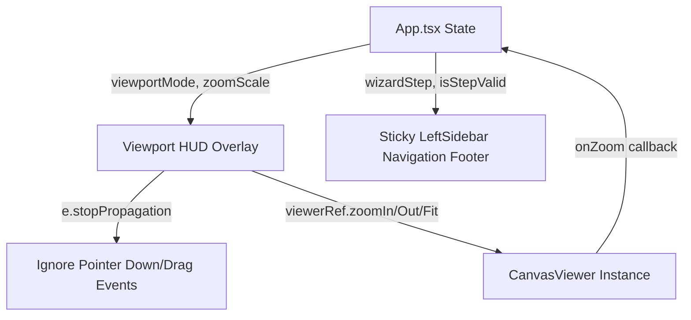

# Phase 09 Patterns: Viewport HUD Overlay & Intuitive Wizard Navigation UX

This document map outlines the code patterns, architectural data flows, and code analogs for the implementation of Phase 9.

---

## 1. Architectural Blueprint & Data Flow

Below is the layout of components and data flow for the interactive viewport HUD, wizard step transition footer, and collapsible sidebar configuration settings.



---

## 2. File Implementation Matrix

| Target File Path | Role | Data Flow | Closest Analog |
|:---|:---|:---|:---|
| [viewer.ts](file:///C:/Users/rickf/.gemini/antigravity/scratch/gempixel/src/engine/viewer.ts) | Canvas Controller | Receives imperative command calls from UI; invokes callbacks back to state updates. | Self (Current [CanvasViewer](file:///C:/Users/rickf/.gemini/antigravity/scratch/gempixel/src/engine/viewer.ts)) |
| [App.tsx](file:///C:/Users/rickf/.gemini/antigravity/scratch/gempixel/src/App.tsx) | Main Orchestrator / View | Manages global step states, viewport rendering options, and aggregates HUD controls. | Self (Current [App](file:///C:/Users/rickf/.gemini/antigravity/scratch/gempixel/src/App.tsx#L238)) |
| [index.css](file:///C:/Users/rickf/.gemini/antigravity/scratch/gempixel/src/index.css) | Stylesheet | Declares backdrop filters, visual tokens, and tooltip layouts. | Self (Current [index.css](file:///C:/Users/rickf/.gemini/antigravity/scratch/gempixel/src/index.css)) |

---

## 3. Component Deep Dive & Analog Excerpts

### A. Viewer Canvas Enhancements
* **Target File:** [viewer.ts](file:///C:/Users/rickf/.gemini/antigravity/scratch/gempixel/src/engine/viewer.ts)
* **Goal:** Extend the [CanvasViewer](file:///C:/Users/rickf/.gemini/antigravity/scratch/gempixel/src/engine/viewer.ts#L8) class to support programmatic zoom options (In, Out, Fit) centered in the viewport, and trigger callbacks on scale adjustment.

**Existing Code Analog:**
The existing wheel listener at [viewer.ts:L110-119](file:///C:/Users/rickf/.gemini/antigravity/scratch/gempixel/src/engine/viewer.ts#L110-L119) utilizes `handleZoom` to scale relative to the cursor position:
```typescript
private handleWheel = (e: WheelEvent) => {
  e.preventDefault();
  const rect = this.canvas.getBoundingClientRect();
  const mouseX = e.clientX - rect.left;
  const mouseY = e.clientY - rect.top;
  
  // Zoom factor: zoom in for scroll up (deltaY < 0), zoom out for scroll down (deltaY > 0)
  const zoomFactor = e.deltaY < 0 ? 1.1 : 0.9;
  this.handleZoom(mouseX, mouseY, zoomFactor);
};
```

**Planned Implementation Pattern:**
```typescript
// Proposed additions to CanvasViewer in src/engine/viewer.ts
public zoomIn() {
  const centerX = this.canvas.width / 2;
  const centerY = this.canvas.height / 2;
  this.handleZoom(centerX, centerY, 1.25);
  this.triggerZoomCallback();
}

public zoomOut() {
  const centerX = this.canvas.width / 2;
  const centerY = this.canvas.height / 2;
  this.handleZoom(centerX, centerY, 0.8);
  this.triggerZoomCallback();
}

public resetZoom() {
  this.fitToContainer();
  this.triggerZoomCallback();
}

private triggerZoomCallback() {
  if (this.onZoomChange) {
    this.onZoomChange(this.scale);
  }
}
```

---

### B. Wizard Navigation & Viewport HUD Integration
* **Target File:** [App.tsx](file:///C:/Users/rickf/.gemini/antigravity/scratch/gempixel/src/App.tsx)
* **Goal:** Restructure step progression navigation, build the glassmorphic top-center Viewport HUD, and partition settings into collapsible groupings.

**1. Floating Viewport HUD Overlay Pattern**
* *Analog:* The current floating center selector at [App.tsx:L2371-2387](file:///C:/Users/rickf/.gemini/antigravity/scratch/gempixel/src/App.tsx#L2371-2387) and zoom controller at [App.tsx:L2351-2368](file:///C:/Users/rickf/.gemini/antigravity/scratch/gempixel/src/App.tsx#L2351-2368).
* *Pattern Details:* Replace them with a combined floating viewport overlay container. Implement event propagation stops to prevent clicking the HUD from panning the canvas.

```tsx
const handleHUDInteraction = (e: MouseEvent | PointerEvent) => {
  e.stopPropagation();
};

{/* Floating glassmorphic HUD bar */}
<div 
  onClick={handleHUDInteraction}
  onPointerDown={handleHUDInteraction}
  className="absolute top-4 left-1/2 -translate-x-1/2 z-40 bg-slate-900/80 backdrop-blur border border-slate-800/80 rounded-xl p-1.5 shadow-2xl flex items-center gap-3.5 no-print select-none"
>
  {/* View mode buttons, zoom buttons, low-zoom warning */}
</div>
```

**2. Sticky Sidebar Wizard Footer Navigation Pattern**
* *Analog:* The existing step-stepper header at [App.tsx:L2258-2324](file:///C:/Users/rickf/.gemini/antigravity/scratch/gempixel/src/App.tsx#L2258-2324).
* *Pattern Details:* Wrap the left sidebar content into a Flexbox layout where form options grow/scroll (`flex-1 overflow-y-auto`) and the stepper actions stick to the bottom (`mt-auto border-t shrink-0`).

```tsx
<aside className="bg-slate-900/60 backdrop-blur-md border-r border-slate-800/80 w-80 p-4 h-full flex flex-col no-print select-none">
  {/* Title/Header (shrink-0) */}
  <div className="border-b border-slate-800/60 pb-3 shrink-0">...</div>

  {/* Settings Forms (flex-1 overflow-y-auto) */}
  <div className="flex-1 overflow-y-auto py-4 flex flex-col gap-4">
    {/* wizard steps conditions */}
  </div>

  {/* Sticky Navigation Footer (mt-auto shrink-0) */}
  <div className="mt-auto border-t border-slate-800/50 pt-3.5 shrink-0 flex flex-col gap-3">
    {/* Stepper Dots & Action Next/Back Buttons */}
  </div>
</aside>
```

**3. Collapsible Card Group Settings Pattern**
* *Analog:* The existing details settings list at [App.tsx:L2068-2070](file:///C:/Users/rickf/.gemini/antigravity/scratch/gempixel/src/App.tsx#L2068-2070).
* *Pattern Details:* Wrap settings modules (such as Ingestion Settings and Palette Optimization) using a standardized details structure.

```tsx
<details className="text-[11px] text-slate-400 cursor-pointer bg-slate-950/20 p-2 rounded border border-slate-850/40" open>
  <summary className="font-semibold text-[10px] uppercase text-indigo-400 select-none">
    Ingestion Settings
  </summary>
  <div className="flex flex-col gap-2 mt-2 pt-2 border-t border-slate-850">
    {/* inputs */}
  </div>
</details>
```

---

### C. Pure CSS Hover Tooltips
* **Target File:** [App.tsx](file:///C:/Users/rickf/.gemini/antigravity/scratch/gempixel/src/App.tsx)
* **Goal:** Include helper tooltips describing wizard configs without adding any third-party JS packages.

**Implementation Pattern:**
Create a wrapper element styled with the Tailwind `group` class. Target the tooltip box inside to display absolutely when the parent is hovered.

```tsx
<div className="group relative z-30 flex items-center">
  <span className="text-[10px] text-slate-500 hover:text-slate-300 cursor-help bg-slate-950 border border-slate-800 w-3.5 h-3.5 rounded-full flex items-center justify-center font-bold">
    ?
  </span>
  <div className="hidden group-hover:block absolute bottom-5 left-1/2 -translate-x-1/2 bg-slate-900 border border-slate-800 p-2 rounded shadow-xl text-[10px] text-slate-300 font-medium w-48 leading-relaxed z-50">
    {tooltipText}
  </div>
</div>
```

---

## 4. Key Design Rules & Pitfalls

1. **Click Event Bubbling:** All buttons inside the HUD overlay must stop event propagation using `e.stopPropagation()` on pointer-down/click/pointer-up events. If omitted, canvas drag panning will trigger concurrently when a user adjusts view controls.
2. **Scrolling Containment:** Sidebar columns must include explicit `overflow-y-auto` styles so that long forms do not expand height parameters, pushing the wizard footer below the screen boundaries.
3. **Viewport Scale State Synchrony:** A state instance `zoomScale` must update dynamically inside [App.tsx](file:///C:/Users/rickf/.gemini/antigravity/scratch/gempixel/src/App.tsx) when [CanvasViewer](file:///C:/Users/rickf/.gemini/antigravity/scratch/gempixel/src/engine/viewer.ts) zoom scale adjustments trigger, ensuring correct rendering thresholds for Symbol warnings.
4. **Symbol Zoom Threshold Cuts:** Symbol textures are hidden if the cell diameter resolves below $10px$. The warning state "⚠️ Low Zoom" displays inside the Viewport HUD if `symbols` mode is selected while scale fits this cutoff (`scale * 16 < 10`).
