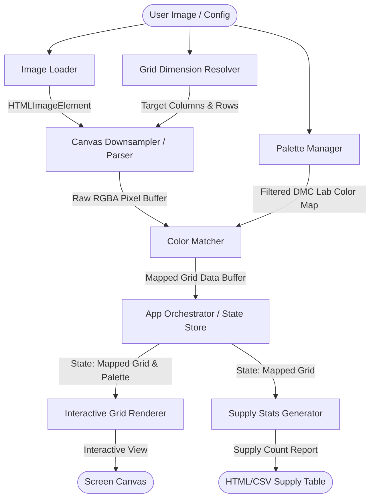
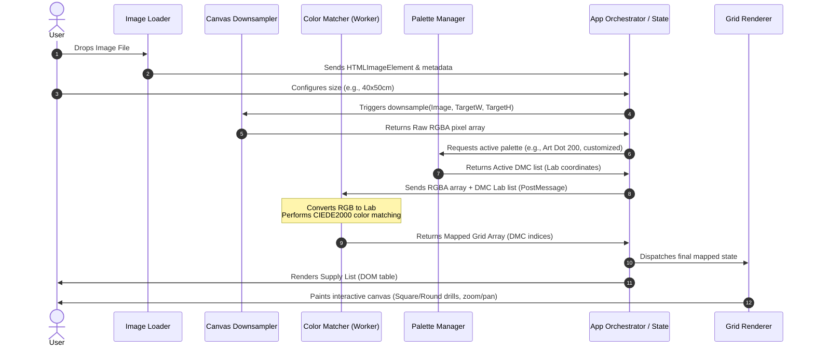

# Architecture Dimension: GemPixel

This document defines the client-side system architecture for **GemPixel**, detailing how it ingests images, downsamples them to a canvas grid, performs perceptual color matching against DMC/Art Dot palettes, and renders interactive previews and supply stats entirely in the browser.

---

## 1. System Architecture

GemPixel is structured as a **unidirectional data-flow client-side application**. It operates entirely within the user's browser context (no backend API, no external storage).

### Component Boundaries



### Component Directory & Responsibilities

| Component | Responsibility | Technical Boundary |
| :--- | :--- | :--- |
| **App Orchestrator** | Manages central reactive state (dimensions, active palette, canvas scale, mapped output). | Coordinates visual UI updates and dispatches events when inputs change. |
| **Image Loader** | Accepts files via drag-and-drop or file picker. Reads image into memory and initializes an `HTMLImageElement`. | Encapsulates local file reading (`FileReader` or `URL.createObjectURL`). |
| **Grid Dimension Resolver** | Resolves canvas physical dimensions ($cm$, $inches$) or raw grid sizes ($rows$, $cols$) into pixel grid counts based on standard drill spacing ($2.5\text{mm}$/drill, $10\text{ drills/inch}$). | Mathematical helper module (pure function). |
| **Canvas Downsampler (Parser)** | Downscales the loaded image using an offscreen canvas `CanvasRenderingContext2D.drawImage` to extract exact target dimensions. | Interacts directly with browser DOM canvas context. Extracts raw RGBA array via `getImageData`. |
| **Palette Manager** | Houses the Art Dot 100/200 DMC color palettes and processes user inclusion/exclusion lists to generate the active matching library. | Reads local static JSON color index map (DMC code $\rightarrow$ RGB & Lab values). |
| **Color Matcher** | Performs perceptual color distance calculations (CIEDE2000) mapping raw RGBA pixels to the nearest active DMC color. | Can run in a **Web Worker** to prevent blocking the main thread during high-res conversions. |
| **Interactive Grid Renderer** | Draws the final pixel grid on a visible canvas. Implements zoom/pan, custom canvas drawing styles (square vs. round drills), and optionally overlays grid lines or symbols. | Interactive canvas element manipulating scaling transforms (`translate`/`scale`). |
| **Supply Stats Generator** | Aggregates matched pixels to compile a summary of unique DMC codes, color labels, total drills needed, and standard bag counts. | Generates structured JSON reports parsed into dynamic DOM lists or exports (CSV). |

---

## 2. Core Data Flow

Data moves sequentially from raw user inputs to structured visual elements. The application prevents infinite loop rendering by strictly separating grid downsampling, color mapping, and display viewport transformations.

### Sequence of Data Operations



1. **Ingest & Parse**: The **Image Loader** reads the source image file, validating the mime-type. It loads the source image dimensions.
2. **Determine Aspect Ratio & Grid Size**: The **Grid Dimension Resolver** matches target physical size to grid boundaries.
   * If a user specifies physical dimensions (e.g., $30\text{cm} \times 40\text{cm}$):
     $$\text{Grid Columns} = \frac{300\text{mm}}{2.5\text{mm}} = 120\text{ drills}$$
     $$\text{Grid Rows} = \frac{400\text{mm}}{2.5\text{mm}} = 160\text{ drills}$$
3. **Downsample**: The **Canvas Downsampler** creates an offscreen canvas at the calculated grid size (e.g., $120 \times 160$ pixels), draws the image stretched/fitted to it, and extracts the raw RGBA image data array.
4. **Filter Palette**: The **Palette Manager** looks up the manufacturer kit base (Art Dot 100 or 200) and filters out any user-excluded DMC color codes.
5. **Map Colors**: The **Color Matcher** iterates through the RGBA pixel array. For each pixel:
   * Converted from sRGB to CIELAB ($L^*a^*b^*$) via standard XYZ color space equations.
   * Compares its $L^*a^*b^*$ coordinates against every color in the active palette using the **CIEDE2000** distance algorithm.
   * Assigns the closest DMC thread ID to the pixel coordinate.
6. **Publish Mapped Grid**: The mapped grid data structure (a flat 2D grid containing DMC codes) is stored in the orchestrator's state.
7. **Draw Canvas View**: The **Interactive Grid Renderer** is notified of the mapped grid data. It draws the visual grid:
   * **Square Drill Style**: Filled colored squares with grid boundaries.
   * **Round Drill Style**: Draw circular canvas paths at cell centers, filled with DMC colors on a contrast background.
   * **Zoom/Pan**: Uses mouse/touch coordinates to modify the canvas transformation matrix without re-calculating the color mapping step.
8. **Compile Stats**: The **Supply Stats Generator** tabulates count data and outputs an interactive HTML table.

---

## 3. High Fidelity Color Matching Mechanics

Matching colors based on raw Euclidean distance in sRGB space ($d = \sqrt{\Delta R^2 + \Delta G^2 + \Delta B^2}$) performs poorly because human eyes do not perceive color changes uniformly across the red, green, and blue spectrum. GemPixel uses **CIELAB (Lab)** color mapping:

### RGB to Lab Color Space Conversion Pipeline
To perform accurate matching, each pixel's RGB coordinates are processed through standard XYZ transformations:
1. **sRGB to XYZ (Linearization)**:
   $$C_{\text{linear}} = \left(\frac{C_{\text{srgb}} + 0.055}{1.055}\right)^{2.4} \text{ for } C_{\text{srgb}} > 0.04045 \text{ (else divide by 12.92)}$$
2. **XYZ to Lab**: Applied using reference white values ($D65$ illuminant).
3. **Distance Calculation**: **CIEDE2000 ($\Delta E_{00}$)** is preferred because it applies corrections for lightness, chroma, and hue differences, compensating for human eyes' hypersensitivity in the blue/magenta regions.

### Performance Optimization Strategy
Since CIEDE2000 calculations are mathematically intensive (involving trigonometric and root operations), running this calculation for larger canvas sizes (e.g., $150 \times 200 = 30,000$ cells) on the main UI thread can cause frame lag (jank).
1. **Web Worker Threading**: The **Color Matcher** is isolated in a background Web Worker. Raw pixel buffers are sent to the worker using *transferable objects* (e.g., `ArrayBuffer`) to eliminate memory copying overhead.
2. **Memoization & Cache Map**: Map matched colors dynamically. A lookup cache stores `RGBA_Hash -> Matched_DMC_Color`. Since images often have repeated pixel colors, caching eliminates up to $70\%$ of redundant Delta E math loops.

---

## 4. Suggested Build Order

To establish a solid, testable codebase, components should be built from the independent core logic outwards to the visual display interface.

```mermaid
gannt
    title Component Build Order Dependencies
    dateFormat  YYYY-MM-DD
    section Phase 1: Engine Core
    Palette Manager & Data Models       :active, p1, 2026-07-07, 3d
    Color Matcher (CIEDE2000 & Lab Math) :active, p2, after p1, 3d
    section Phase 2: Processing
    Image Loader & Downsampler        :p3, after p2, 4d
    Grid Dimension Resolver             :p4, after p2, 2d
    section Phase 3: Presentation
    Interactive Grid Renderer (Zoom/Pan):p5, after p3, 5d
    Supply Stats Generator             :p6, after p3, 3d
    section Phase 4: Customization
    Sub-Palette Filter UI & Export      :p7, after p6, 4d
```

### Build Phase Breakdown & Rationale

1. **Phase 1: Engine Core (No UI Dependency)**
   * **Step 1**: Build the **Palette Manager** with the Art Dot static dataset. Ensure palettes can be queried, filtered, and returned.
   * **Step 2**: Implement XYZ/Lab converters and the CIEDE2000 **Color Matcher** algorithm. Write automated unit tests verifying that raw RGB values map correctly to their expected DMC numbers.
   * *Rationale*: Ensures calculations are mathematically accurate before hooking them up to complex user actions.

2. **Phase 3: Ingest & Processing Interface**
   * **Step 3**: Develop the **Grid Dimension Resolver** to ensure coordinate math parses correctly.
   * **Step 4**: Build the **Image Loader** and **Canvas Downsampler**. Write a script that loads an image, downsamples it to a $10 \times 10$ resolution, and verifies the raw RGBA output array length matches exactly $400$ bytes.
   * *Rationale*: Resolves sizing constraints before attempting to render canvas elements.

3. **Phase 3: Interactive Presentation**
   * **Step 5**: Build the **Interactive Grid Renderer**. Handle viewport canvas scaling, zoom, pan, and rendering patterns (circle vs square). Connect it directly to the downscaled grid array.
   * **Step 6**: Develop the **Supply Stats Generator**. Match cell counts, output a tabular representation on the page, and verify drill requirements calculate correctly.
   * *Rationale*: Separating presentation from calculations ensures canvas scaling triggers do not rerun color-matching routines.

4. **Phase 4: Palette Control & Polish**
   * **Step 7**: Build the palette manager UI controls (custom sub-palettes toggles) and connect them back to trigger recalculations.
   * *Rationale*: User customizations require a fully functioning state-loop to dynamically update the view and report.
