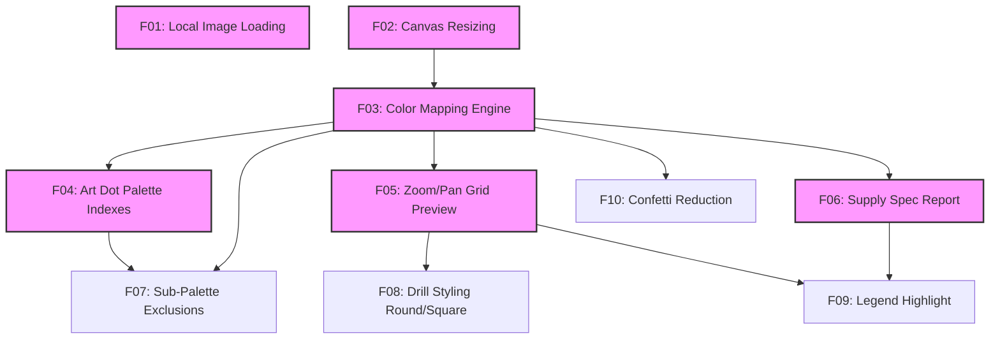

# GemPixel Features Research

This document analyzes the feature landscape for client-side image-to-pixel-art generators specifically focused on diamond painting/gem art supply planning. It establishes what is **table stakes** (essential to launch), what will make GemPixel **differentiate** in the market, and what are explicit **anti-features** to maintain project scope and efficiency.

---

## 1. Table Stakes (Must-Haves)
These features are essential for a basic, functioning utility. If any of these are missing, users will not be able to complete their primary workflow of planning their diamond painting kits.

### 1.1 Local Image Loading (Client-Side Only)
* **Description**: Users upload their custom image files (PNG, JPEG, WEBP) directly in the browser using the HTML5 `FileReader` API. 
* **Rationale**: Privacy is paramount for artists working with custom commissions or personal photos. Zero server uploads ensure privacy and fast response times.
* **Complexity**: **Low**
* **Dependencies**: None

### 1.2 Dual-Mode Canvas Resizing
* **Description**: Two ways for the user to define their output grid dimensions:
  1. **Direct Grid Dimensions**: Set explicit grid sizes (e.g., 40x40, 60x80 pixels).
  2. **Physical Dimensions (Density-Based)**: Specify canvas in cm or inches (e.g., 30x40cm) and calculate the grid size automatically based on standard diamond painting dimensions (2.5mm per drill, which equals 4 drills/dots per cm or 10.16 dots per inch).
* **Rationale**: Manufacturers sell blank canvases in standard physical sizes, while advanced planners think in grid count. Supporting both models is essential.
* **Complexity**: **Low-Medium**
* **Dependencies**: None

### 1.3 High-Fidelity Color Mapping Engine (Lab / Delta E)
* **Description**: Converts the input image pixels to standard DMC color codes.
* **Rationale**: Simple RGB Euclidean distance matches poorly with human color perception (e.g., mixing up dark greens with dark blues). We must convert RGB colors to CIELAB space and use a perceptual formula (CIEDE2000 or Delta E 1994) to match the closest available DMC thread color.
* **Complexity**: **High**
* **Dependencies**: *1.2 Dual-Mode Canvas Resizing* (must resize the image first before color-mapping pixels)

### 1.4 Manufacturer Palette Matching (Art Dot 100 & 200 Kits)
* **Description**: Pre-defined indexes of standard DMC color mappings representing the specific color lists in the Art Dot 100-color and 200-color kits. Users select their kit, and the mapping engine restricts matches *only* to those colors.
* **Rationale**: Users want to make custom canvas designs using the inventory they already have from buying standard Art Dot kits.
* **Complexity**: **Medium**
* **Dependencies**: *1.3 High-Fidelity Color Mapping Engine*

### 1.5 Interactive Grid Preview (Zoom & Pan)
* **Description**: An interactive canvas-based preview displaying the pixelated grid. Users can scroll to zoom in/out and drag to pan across large canvases.
* **Rationale**: High-detail grids (e.g., 60x80 dots is 4,800 pixels) cannot be inspected effectively on a static screen. Users need to inspect micro-details and color groupings.
* **Complexity**: **Medium**
* **Dependencies**: *1.3 High-Fidelity Color Mapping Engine*

### 1.6 Supply Specification Report
* **Description**: A tabular list of all mapped colors, displaying:
  * Mapped DMC Code
  * Visual Color Swatch
  * DMC Color Name
  * Exact quantity of drills required
  * Standard +10% safety buffer count
* **Rationale**: The final deliverable. Artists use this list to order beads, inventory their collection, and sort their organizer boxes before peeling the canvas adhesive.
* **Complexity**: **Low-Medium**
* **Dependencies**: *1.3 High-Fidelity Color Mapping Engine*

---

## 2. Differentiators (Competitive Advantage)
These features set GemPixel apart from generic cross-stitch or pixel-art makers by solving real physical constraints faced by gem art hobbyists.

### 2.1 Active Sub-Palette Selector (Include/Exclude Toggles)
* **Description**: A checklist of the selected manufacturer palette (Art Dot 100/200) where users can click to disable or enable specific colors. Disabling a color triggers an instant client-side recalculation, mapping pixels containing that color to the next closest available color.
* **Rationale**: Artists frequently run out of specific colors in their inventory (e.g., running out of DMC 310 Black). Being able to exclude missing colors and let the algorithm adapt the pattern to what they *currently have* is a massive usability win.
* **Complexity**: **Medium**
* **Dependencies**: *1.4 Manufacturer Palette Matching*, *1.3 High-Fidelity Color Mapping Engine*

### 2.2 Drill Styling Engine (Square vs. Round Preview)
* **Description**: Visual style options for the grid cells:
  * **Square Drills**: Full-coverage grid cells representing square drills (mosaic look).
  * **Round Drills**: Circular dots drawn with gaps in the corners, exposing the backing canvas color.
* **Rationale**: Round vs. square canvases look radically different in real life. Round canvases show more gaps and look less dense; showing this realistically helps manage artist expectations before laying down physical drills.
* **Complexity**: **Medium**
* **Dependencies**: *1.5 Interactive Grid Preview*

### 2.3 Legend Highlight (Hover/Click to Locate)
* **Description**: Hovering over or clicking a row in the Supply Specification Report highlights all corresponding pixels on the visual preview canvas (making them blink or dimming all other colors).
* **Rationale**: Helps the artist visually locate where rare or accent colors are positioned on the canvas. Useful during the actual assembly phase.
* **Complexity**: **Medium**
* **Dependencies**: *1.5 Interactive Grid Preview*, *1.6 Supply Specification Report*

### 2.4 Confetti Reduction Pass
* **Description**: A processing step (such as a minor noise reduction or median filter) that groups isolated single pixels (known as "confetti" in the community) into their nearest neighboring color clusters.
* **Rationale**: "Confetti" is the bane of diamond painting, as changing drill colors for a single dot is tedious and slows down workflow. Reducing confetti yields clean, solid blocks of color that are easier to construct.
* **Complexity**: **Medium-High**
* **Dependencies**: *1.3 High-Fidelity Color Mapping Engine*

---

## 3. Anti-Features (Out of Scope)
To ensure high performance and a zero-maintenance client-side architecture, the following features are explicitly out of scope.

### 3.1 Server-Side User Accounts & Canvas Saving
* **Avoid Because**: It introduces database maintenance, security requirements, user auth overhead, and hosting costs.
* **Alternative**: Users can download a local JSON configuration file containing their grid settings, custom sub-palettes, and target image, which they can reload into the tool later.

### 3.2 Canvas Paint/Draw/Erase Tools
* **Avoid Because**: Building a fully-featured, bug-free pixel-art canvas editor (pencil, eraser, paint bucket, undo/redo) is a massive frontend project that competes with existing tools like Aseprite or Piskel.
* **Alternative**: The tool is a *generator and planner*. Image edits must be done in standard photo editing software (Photoshop, GIMP) before loading into GemPixel.

### 3.3 E-Commerce & Direct Drill Checkout
* **Avoid Because**: Integrating Shopify, manufacturer APIs, or payment gateways introduces significant transaction security compliance, affiliate agreements, and api maintenance.
* **Alternative**: Output a clean CSV/TXT export that users can copy-paste into third-party drill supplier sites (like ARTDOT, Diamond Art Club, or Etsy stores).

### 3.4 Vector Symbols Grid Export (Printable PDF Grid)
* **Description**: Generating a high-resolution PDF where every single tiny pixel contains a vector symbol (cross-stitch style).
* **Avoid Because**: Rendering thousands of symbols into a multi-page PDF entirely in-browser is highly resource-intensive and prone to browser crashes.
* **Alternative**: Export a high-resolution PNG image grid alongside a structured text checklist.

---

## 4. Feature Dependency & Complexity Matrix

Below is a breakdown of the design requirements, development complexity, and immediate parent dependencies.

| Feature ID | Feature Name | Category | Complexity | Dependencies |
|------------|--------------|----------|------------|--------------|
| **F01** | Local Image Loading | Table Stakes | Low | None |
| **F02** | Dual-Mode Canvas Resizing | Table Stakes | Low-Medium | None |
| **F03** | Color Mapping Engine (Lab) | Table Stakes | High | F02 |
| **F04** | Art Dot Palette Indexes | Table Stakes | Medium | F03 |
| **F05** | Zoom/Pan Grid Preview | Table Stakes | Medium | F03 |
| **F06** | Supply Specification Report | Table Stakes | Low-Medium | F03 |
| **F07** | Sub-Palette Exclusions | Differentiator | Medium | F03, F04 |
| **F08** | Drill Styling (Round/Square) | Differentiator | Medium | F05 |
| **F09** | Legend Highlight | Differentiator | Medium | F05, F06 |
| **F10** | Confetti Reduction | Differentiator | High | F03 |

### Dependency Flow

